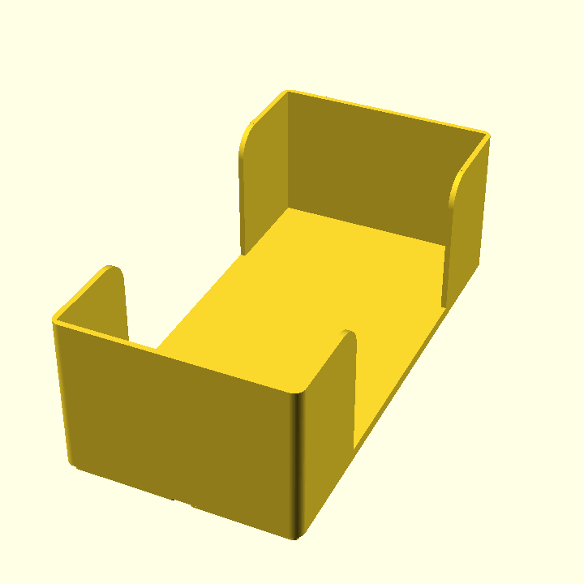
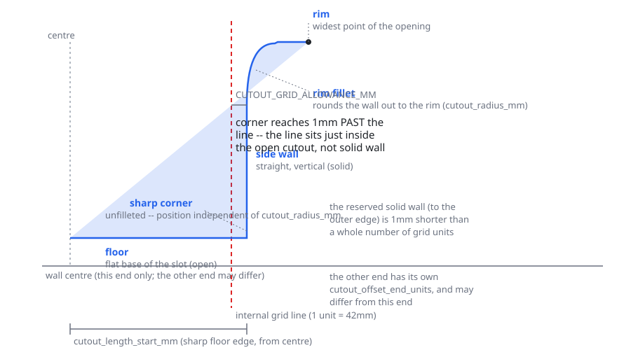
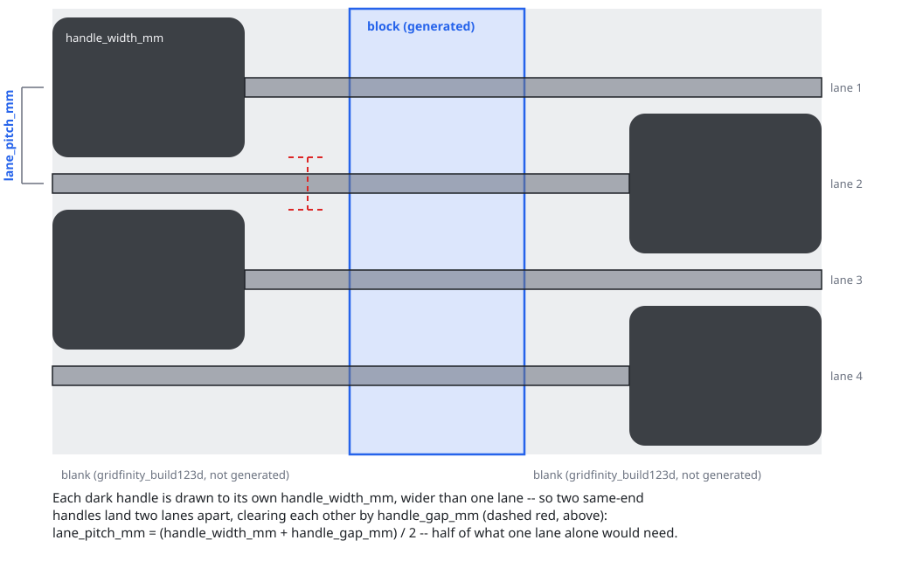

# count-spatula

[](https://github.com/Bear-Prince/count-spatula/actions/workflows/tests.yml?query=branch%3Amain)
[](https://codecov.io/gh/Bear-Prince/count-spatula)

## Example models



Renders of the models above are CC BY-SA 4.0 (see [Licensing](#licensing)); the generator code itself is
Apache 2.0. Regenerate them with `uv run python render_models.py` (requires `openscad` and `imagemagick`
on `PATH`).

## OpenSpec (local to this repo)

This repository uses the OpenSpec CLI as a local dev dependency.
Run it with `pnpm` so you do not depend on a global PATH setup.

### Common commands

```bash
pnpm exec openspec --version
pnpm exec openspec --help
pnpm exec openspec new change "my-change-name"
```

You can also use the package script alias.
When passing flags to the underlying CLI, include `--` so pnpm forwards
arguments to `openspec`:

```bash
pnpm run openspec -- --version
pnpm run openspec -- --help
```

## Generated files

Do not edit `pnpm-lock.yaml` directly.
Regenerate it with pnpm commands (for example, `pnpm install` or `pnpm install
--lockfile-only`) so it stays valid and reproducible.

## STL / 3MF CLI

The generator produces a `KitchenBin` (a Gridfinity bin with an explicitly-sized
rounded pocket and optional full-height side cutouts) or a `CutleryBin` (a
`KitchenBin` whose pocket is split into equal columns by straight dividers, with
the cutout running through them). Use `--output` to specify the path (format is
chosen by file extension), or `--format stl|3mf` to set the default extension
when `--output` is omitted.

Generic equal-compartment grids are out of scope here — use
[`gridfinity_build123d`](https://github.com/Ruudjhuu/gridfinity_build123d)
directly for those.

### KitchenBin (default)

Generate a default bin:

```bash
uv run python main.py
```

Generate with explicit parameters and a custom output path:

```bash
uv run python main.py \
  --grid-x 4 \
  --grid-y 6 \
  --height-mm 56 \
  --pocket-length-mm 220 \
  --pocket-width-mm 160 \
  --output build/kitchen_bin_custom.stl
```

### Presets

Seed parameters from a named preset (currently `chop-board`, which reproduces the
original chopping-board bin), overriding any field on top:

```bash
uv run python main.py --preset chop-board
uv run python main.py --preset chop-board --grid-x 5 --output build/wide_chop.stl
```

### CutleryBin (dividers)

Split the pocket into equal columns with `--divisions` (two or more makes a
`CutleryBin`):

```bash
uv run python main.py --divisions 4 --output build/cutlery_4.stl
```

### Disabling cutouts

Side cutouts are enabled by default. When bins sit in a drawer where the notches
do not line up, disable them with `--no-cutouts` to leave the walls (and any
dividers) solid:

```bash
uv run python main.py --no-cutouts
```

### Cutout geometry



Each side cutout is a scoop with a sharp floor corner and one filleted corner
(`--cutout-radius-mm`, default 10 mm):

- **floor** — the flat base of the slot.
- **sharp corner** — where the floor meets the side wall; unfilleted, so its position does not
  depend on the radius.
- **side wall** — the straight vertical section.
- **rim fillet** — rounds the side wall out to the wider top opening.
- **rim** — the widest point, where the slot meets the top of the wall.

`--cutout-offset-units` sets how many whole Gridfinity grid units of solid wall are reserved at each
end, as one value (applies to both ends, default 1) or two (`start end`, set independently — handy
for aligning bins of different lengths at a shared end, e.g. `--cutout-offset-units 1 2`). The
reserved solid wall is a fixed 1 mm shorter than that whole number of units, so the sharp floor
corner reaches 1 mm past the corresponding internal grid line — the line itself sits just inside the
open cutout, not the solid wall — regardless of the chosen radius.

### Other options

Export as 3MF using the default filename:

```bash
uv run python main.py --format 3mf
```

Warn when the bin footprint exceeds a print bed (export still proceeds):

```bash
uv run python main.py --grid-x 6 --grid-y 4 --bed-x 235 --bed-y 235
```

The CLI validates parameter ranges and returns a non-zero exit code with
actionable text when values are invalid (including an unknown `--preset`).

## Knife blade block

`--knife-block` builds a `KnifeBladeBlock` instead of a bin: a small Gridfinity module that holds
kitchen knives lying flat, edge-down, gripped by their blades rather than their handles. Knives
alternate head-to-toe so their handles fall to opposite ends, and every blade passes through the
same block, in a tapered slot that self-centres blades of different thickness and keeps the cutting
edge floating clear of the printed material.

```bash
uv run python main.py --knife-block
```

### Lane geometry



Because a handle (`handle_width_mm`) is wider than a blade, two knives with handles at the *same*
end must sit two lanes apart, not one — alternating head-to-toe is what makes that work. The lane
pitch is derived from that constraint:

```text
lane_pitch_mm = (handle_width_mm + handle_gap_mm) / 2
```

`handle_gap_mm` is the finger clearance left between two same-end handles once the pitch is applied.
The default (7 lanes, 26 mm handle width, 10 mm handle gap) is sized for a set of seven
similarly-lengthed kitchen knives with 2–3 mm spines — it produces a 3×2 Gridfinity module (126 mm
across seven 18 mm lanes). Override the layout with `--knife-count`, `--handle-width-mm`, and
`--handle-gap-mm`; `--grid-x`/`--grid-y` set the block's own footprint in this mode.

**Only the block is generated.** The handle-rest zones at each end are generic — fill them with
plain [`gridfinity_build123d`](https://github.com/Ruudjhuu/gridfinity_build123d) blanks rather than
anything this project produces. The one interface between the block and those blanks is the block's
own height: use a blank of that height under the handles so the knives rest level. Query it directly:

```python
from knife_block import KnifeBlockParameters

KnifeBlockParameters().deck_height_mm  # 18.0 mm by default
```

`--drawer-height-mm`, `--max-blade-depth-mm`, and `--drawer-clearance-mm` control a drawer-fit
check (in the same non-blocking, warn-and-still-export spirit as the print-bed check): it warns
when the block's height plus your tallest knife's blade depth plus a safety margin would exceed
your drawer's internal height. Defaults assume a 78 mm drawer and a 40 mm typical blade depth —
override `--max-blade-depth-mm` for anything taller, such as a cleaver (not part of the default
7-knife set; a cleaver needs its own, currently unimplemented, angled-slot variant).

This is an original design (our own measurements and profiles), CC BY-SA 4.0 like the project's
other original bins.

## Licensing

This project ships two kinds of work under two different licenses:

- **Generator code** → [Apache License 2.0](LICENSE).
- **Generated model files** (STL/STEP/3MF) → [CC BY-SA
  4.0](https://creativecommons.org/licenses/by-sa/4.0/) (full text in
  [`LICENSES/CC-BY-SA-4.0.txt`](LICENSES/CC-BY-SA-4.0.txt)).

All generated models are CC BY-SA 4.0: **derived** bins (those reproducing The
Next Layer's design) by the ShareAlike obligation, and **original** bins (our own
measurements and profiles, e.g. the `chop-board` IKEA bin) by deliberate choice.
Each preset records its `provenance` (`original` or `derived`) and model license.

See [CREDITS.md](CREDITS.md) for the full design lineage and per-model attribution
rules, and [NOTICE](NOTICE) for retained dependency notices.

### Dependency and source licenses (verified)

| Work | Author | License |
| --- | --- | --- |
| Gridfinity | Zack Freedman | MIT |
| `gridfinity_build123d` | Ruudjhuu | MIT |
| `build123d` | gumyr / contributors | Apache 2.0 |
| "Gridfinity Complete Kitchen Collection" | The Next Layer (JonathanLevi) | CC BY-SA 4.0 |
| "Gridfinity Blanks" | atmmilani (Thingiverse) | CC BY 4.0 |

### Attribution for derived models

Any **derived** bin must ship with the CC BY-SA 4.0 attribution block (credit The
Next Layer, link the Printables source, link the license, state that changes were
made, preserve prior notices, mark our version as also CC BY-SA 4.0). It must also
credit the upstream author atmmilani (CC BY 4.0), whose attribution requirement
persists downstream. The exact block lives in [CREDITS.md](CREDITS.md). The
repository currently contains no derived presets.

### Distribution constraint

Derived (CC BY-SA 4.0) models may only be published to platforms that preserve
CC BY-SA 4.0 (for example Printables and Thingiverse). They must **not** be
published under an exclusive or ShareAlike-incompatible platform license (for
example MakerWorld's exclusive Standard Digital File License). Any future upload
tooling must enforce this and respect each platform's terms of service.

This is a working understanding, not legal advice.
