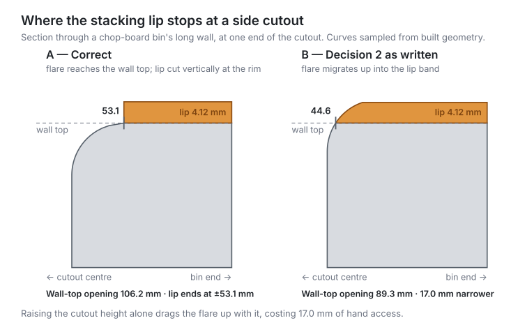

## Context

`KitchenBin` builds its own walls on top of `gridfinity_build123d.BaseEqual`; it does not use that library's
`Bin` class. That matters here, because `Bin` accepts a `lip=StackingLip()` argument and does the work for
us — a route we cannot take without rewriting how our bins are constructed.

Fortunately `StackingLip` is not coupled to `Bin`. Its whole interface is:

```python
StackingLip().create(path: Wire) -> BasePartObject
```

It sweeps the Gridfinity profile along whatever closed wire it is given, and `Bin` merely happens to pass
its own top rim. We can pass ours.

Three facts were established empirically against the pinned library before writing this design:

1. **The sweep works on our geometry.** A prototype swept `StackingLip` along a `KitchenBin`-style wall's
   top outer wire and produced a valid solid with an unchanged 83.50 × 167.50 mm footprint.
2. **The lip adds ~4.117 mm, not the nominal 4.4 mm.** `StackingLip.create` applies `fillet(vertex, 0.2)`
   to the profile apex. The published reference states "+~4.4mm" with a tilde, so this is within the
   standard's own tolerance — but tests must assert the measured value, not the nominal one.
3. **Side cutouts fragment the rim.** A bin with `cutouts_enabled=True` has **two** disconnected faces at
   its top Z, not one. There is therefore no single closed wire to sweep on a cut bin — and the chop-board
   preset, the bin this change most wants to serve, always has cutouts.

Fact 3 is the crux, and is almost certainly what made this look "too complicated" the first time round.

## Goals / Non-Goals

**Goals:**

- An opt-in stacking lip available to every bin type, including cutout-bearing presets like `chop-board`.
- Conformance to the Gridfinity standard by composing the upstream `StackingLip`, not by authoring profile
  geometry ourselves.
- Complete independence from pocket shape, pocket corner radius, and divider layout.
- Zero change to any existing output when the flag is not passed.

**Non-Goals:**

- Baseplates, or the `PLATE` variant of the stacking profile. Bins only.
- A lip on any rim other than the outer top rim (no pocket-edge or divider-top lips).
- Re-plumbing `KitchenBin` onto `gridfinity_build123d.Bin`. That is a larger refactor with its own UAT
  burden, and is not required to ship this.
- Changing the default height semantics. `effective_height_mm` continues to mean wall height above the
  inner floor, with the lip sitting above it.

## Decisions

### Decision 1: Build the lip before the cutout subtraction, not after the part is finished

The originating idea was to add the lip "after the bin has been generated". That instinct is right about
*coupling* — the lip is genuinely an independent step that needs nothing from the pocket or dividers — but
it cannot be implemented literally as a post-pass on the completed part, because of fact 3 above: once the
cutouts are subtracted, the rim is two open arcs and there is no closed wire left to sweep.

The build order therefore becomes:

1. Extrude the walls (unchanged).
2. Add interior dividers via `_add_interior` (unchanged).
3. **Sweep the lip along the still-intact top outer wire.** ← new step
4. Subtract the side cutouts, now sized to cut through the lip as well.

The lip step still knows nothing about pockets or dividers — it reads only the top face's outer wire — so
the decoupling the idea was reaching for is fully preserved. Only the *ordering* is constrained.

**Alternative considered:** sweep along an analytically-reconstructed outer rounded-rectangle wire after
the cutouts, then re-subtract the cutout from the lip alone. This permits a literal post-pass, but it
duplicates the outer-profile derivation in a second place where it can silently drift from the wall sketch,
and it performs the same boolean twice. Rejected as strictly more fragile for no benefit.

### Decision 2: Cut through the lip with a separate straight section, not by raising `cutout_height`

`SideCutoutProfile` is currently built with `cutout_height = top_z - floor_z`, which stops exactly at the
wall top. Left alone, the cutout would pass under a lip that now sits above it, leaving the lip bridging
across the open handle slot — an unsupported span over fresh air that both blocks the handle opening and
prints badly. So the cut must reach above the lip.

**It must not do so by simply raising `cutout_height`.** The rim flare patches in `SideCutoutProfile` are
anchored to `cutout_height` — the *top* of the profile — not to the floor, and the fillet that produces the
flare spans the topmost `cutout_radius` (10 mm by default) of the profile. Raising the height therefore
drags the whole flare upward with it. Measured on the chop-board preset, sampling the built profile at the
wall top:

| Profile | Opening at the wall top |
| --- | --- |
| Current (`cutout_height` = wall height) | **106.2 mm** — the full flared rim |
| Raised to clear the lip | **89.3 mm** — flare has moved into the lip band |

That is 17.0 mm of hand access lost on the bin whose cutout exists specifically so a chopping board can be
lifted out, and it puts the flare on the lip — a crisp stacking interface — rather than on the wall.

The correct construction keeps the existing profile exactly as it is, so the flare still reaches the wall
top, and adds a *separate* straight-sided section above it spanning the full arc width
(`cutout_arc_start` / `cutout_arc_end`), running from the wall top up past the top of the lip.



The lip therefore terminates in a clean vertical face at the rim's widest point (±53.1 mm from the cutout
centre on the chop-board), and does not follow the flare's curve down into the opening. That face is fully
supported: the cutout only ever narrows going down, so there is progressively more wall beneath the lip,
never less.

The result is a lip present on the uncut rim segments and cleanly absent across each handle slot — the
correct physical outcome, since a bin stacked on top bears on the intact rim.

### Decision 3: Opt-in, defaulting to off

`stacking_lip: bool = False` on `BinParameters`, surfaced as `--stacking-lip` on the CLI. Every current
invocation, preset, and previously exported artifact stays identical unless the flag is passed. Presets need
no special handling: `bin-presets` already specifies that overrides apply on top of preset defaults, so
`--preset chop-board --stacking-lip` works through the existing mechanism.

**Alternative considered:** default the lip on, since it is what the Gridfinity standard expects. Rejected —
it would silently change every existing output, add ~4.12 mm to every bin's height, and retroactively alter
the chop-board artifact. Not a decision to make on the user's behalf.

### Decision 4: Validate the lip's inward reach against wall thickness

The `BIN` profile spans `height_1 + height_3_bin` = 0.7 + 1.9 = **2.6 mm** horizontally, measured inward
from the outer wall face. Our default wall is 2 mm, so on a default bin the lip overhangs the pocket mouth
by 0.6 mm, narrowing the opening slightly relative to the pocket below.

This is normal Gridfinity behaviour — standard bins have thinner walls than the lip is deep, and the
prototype confirms a 2 mm wall still yields a valid solid. It is not an error. But it is surprising enough
to warrant a documented rule rather than a silent geometry change, and on a sufficiently thin wall the lip
would consume the entire wall and reach past the pocket edge.

The chop-board preset is unaffected: its walls are 3.75 mm (X) and 15.75 mm (Y), comfortably clear of 2.6 mm.

### Decision 5: Lip height is additive to the stated height, and must be documented as such

Resolving the open question below: `--height-mm` / `height_in_units` continue to mean wall height above
the inner floor, unaffected by whether a lip is requested. The lip sits *above* that height, matching
upstream `Bin` (whose docstring notes the lip's size "is not included in height"). A lipped bin's actual
total height therefore exceeds the requested height by ~4.12 mm.

This is easy to miss, so it must be stated explicitly rather than left implicit in the parameter
description: the README's stacking-lip section and `CLAUDE.md` both need a line to the effect of "the lip
is added after the bin's wall height is built, so the model's total height is the requested height plus
~4.12 mm, not the requested height itself." This is the same fact as the print-bed risk below, surfaced in
user-facing docs rather than only in code comments.

**Alternative considered:** silently absorb the lip into the requested height (e.g., build ~4.12 mm less
wall when a lip is requested, so total height matches the request exactly). Rejected — this would make
wall height, and therefore pocket depth, vary depending on whether a lip is enabled, coupling two things
that should stay independent, and would drift from upstream `Bin`'s established semantics for no real
benefit.

### Decision 6: Do not forbid the lip on bins with side cutouts

A discontinuous lip invites the question of whether it is worth having at all on a cutout bin. Measuring
the rim that actually survives says yes, comfortably:

| Bin | Rim keeping its lip | Lip per end, on each cut wall |
| --- | --- | --- |
| `chop-board` (2-unit cutout offset) | 75% (628 of 840 mm) | 72.9 mm |
| Default 1-unit cutout offset | 58% on a 2×4 | 30.9 mm |

The surviving length per end is **constant at 30.9 mm for any `grid_y`** with the default offset, because
the offset is a whole grid unit and the rim fillet reaches a fixed `cutout_radius + 0.1 mm` past it — so
short bins are not a degenerate case that needs its own rule. Both walls perpendicular to the cutout keep
their lip in full, so a stacked bin is still located laterally on all four sides.

Adding a `cutouts_enabled` / `stacking_lip` mutual exclusion would therefore remove a working feature from
the exact bin that motivated this change. Not done.

## Risks / Trade-offs

- **A lip on a cutout bin is discontinuous** → By design, not a defect; a stacked bin bears on the intact
  rim segments. Worth stating explicitly in the spec so it is never mistaken for a geometry bug.
- **Height growth may newly trip the print-bed warning** → Correct behaviour, since `check_print_bed`
  measures the real bounding box. Called out in the proposal so it is not read as a regression.
- **The 4.117 mm figure is a property of the pinned library, not the standard** → If the
  `gridfinity_build123d` pin is ever bumped, a changed apex fillet would move this number. Assert it with a
  tolerance rather than exact equality, and treat a shift as the UAT signal the CLAUDE.md pin policy
  already calls for.
- **Thin-wall overhang narrows the pocket mouth** → Validation rule per Decision 4; the default 2 mm wall
  is explicitly still allowed.
- **Sweeping along a filleted rounded-rectangle wire is the least-tested path in the upstream sweep** →
  Mitigated by the prototype (valid solid on a 3.75 mm corner radius), and by real-geometry tests covering
  both a rounded and a sharp-cornered rim.
- **The lip terminates directly above the rim fillet's tangent point** → The fillet meets the wall top
  tangentially, so the wall recedes almost horizontally just below where the lip ends. This is already the
  most delicate part of the existing cutout rim, and the lip adds material above it. The tests can confirm
  the slot is clear and the solid is valid, but not that it prints cleanly — so this specific transition is
  an explicit slicer-preview check in the UAT step, not something to sign off from geometry alone.

## Migration Plan

No migration. The feature is additive and defaults to off; no existing artifact, preset, or CLI invocation
changes behaviour. Rollback is removing the flag.

## Open Questions

None outstanding. The height-semantics question originally listed here is resolved by Decision 5.
